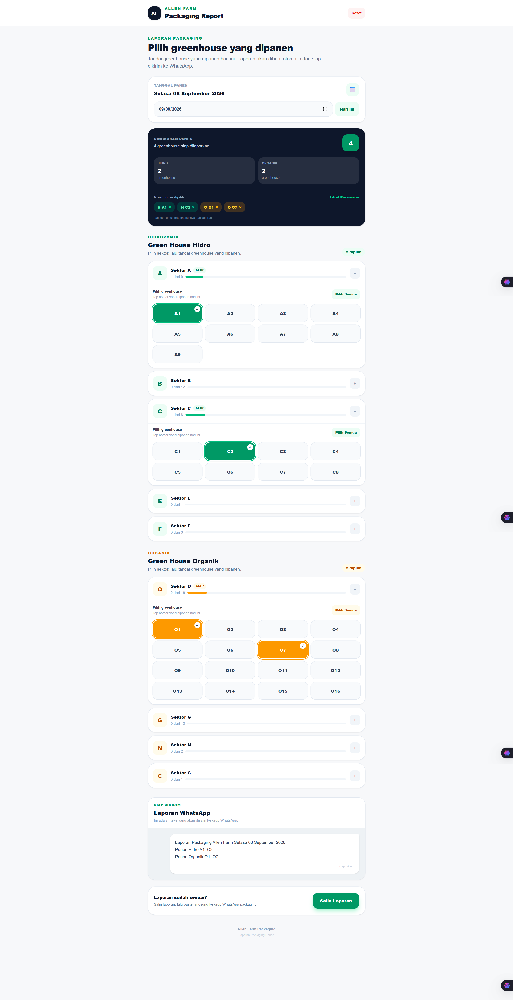

# Allen Farm Packaging

Aplikasi internal sederhana untuk membantu tim packaging Allen Farm membuat laporan panen harian dengan lebih cepat, konsisten, dan praktis.

Aplikasi ini menggantikan proses penulisan laporan secara manual dengan alur sederhana:

**Pilih greenhouse → Generate laporan → Copy → Paste ke WhatsApp**

## 📱 Preview



## ✨ Fitur

- 📋 Memilih greenhouse yang dipanen
- 🌱 Memisahkan greenhouse Hidroponik dan Organik
- 🗂️ Mengelompokkan greenhouse berdasarkan sektor
- 📅 Menentukan tanggal panen
- 📝 Membuat laporan WhatsApp secara otomatis
- 📋 Menyalin laporan ke clipboard
- 🔄 Reset seluruh pilihan greenhouse
- 👀 Preview laporan sebelum dikirim
- 📱 Mobile-first dan responsive
- ⚡ Tidak membutuhkan database untuk versi saat ini

## 📝 Contoh Laporan

Setelah greenhouse dipilih, aplikasi menghasilkan laporan dengan format:

```text
Laporan Packaging Allen Farm Minggu 06 September 2026
Panen Hidro A6, A7, B11
Panen Organik O3, O8, O12
```

Laporan tersebut dapat langsung disalin dan ditempel ke grup WhatsApp.

## 🔄 Alur Penggunaan

1. Pilih tanggal panen.
2. Pilih greenhouse Hidroponik yang dipanen.
3. Pilih greenhouse Organik yang dipanen.
4. Periksa ringkasan pilihan.
5. Lihat preview laporan.
6. Tekan **Salin Laporan**.
7. Paste laporan ke grup WhatsApp packaging.

## 🏗️ Struktur Project

```text
allen-farm-packaging/
│
├── app/
│   ├── page.tsx
│   ├── layout.tsx
│   ├── globals.css
│   │
│   ├── classic/
│   │   └── page.tsx
│   │
│   └── experiment/
│       └── page.tsx
│
├── components/
│   ├── GreenhouseButton.tsx
│   ├── GreenhouseSection.tsx
│   └── ReportPreview.tsx
│
├── data/
│   └── greenhouses.ts
│
├── public/
│   └── preview.png
│
├── package.json
├── tsconfig.json
├── next.config.ts
├── postcss.config.mjs
└── README.md
```

### Penjelasan Folder

#### `app/`

Berisi halaman dan konfigurasi utama Next.js.

- `page.tsx` — halaman utama aplikasi
- `layout.tsx` — root layout, metadata, dan konfigurasi font
- `globals.css` — styling global
- `classic/` — versi layout sebelumnya
- `experiment/` — versi pengembangan/eksperimen

#### `components/`

Berisi komponen UI yang digunakan oleh aplikasi.

- `GreenhouseButton.tsx` — tombol pilihan greenhouse
- `GreenhouseSection.tsx` — section dan pengelompokan greenhouse
- `ReportPreview.tsx` — preview laporan WhatsApp

#### `data/`

Berisi data greenhouse yang digunakan aplikasi.

File utama:

```text
data/greenhouses.ts
```

## 🌱 Data Greenhouse

### Hidroponik

- A1 – A9
- B1 – B12
- C1 – C8
- E1
- F1 – F3

### Organik

- O1 – O16
- G1 – G12
- N1
- C9

Data greenhouse dapat diperbarui melalui:

```text
data/greenhouses.ts
```

## 🛠️ Tech Stack

- [Next.js](https://nextjs.org/)
- React
- TypeScript
- Tailwind CSS
- Git
- GitHub
- Vercel

## 🚀 Menjalankan Project

### Prerequisites

Pastikan sudah terinstall:

- Node.js
- npm
- Git

### 1. Clone Repository

```bash
git clone https://github.com/fidataufiq/allen-farm-packaging.git
```

### 2. Masuk ke Folder Project

```bash
cd allen-farm-packaging
```

### 3. Install Dependencies

```bash
npm install
```

### 4. Jalankan Development Server

```bash
npm run dev
```

Kemudian buka:

```text
http://localhost:3000
```

## 🔍 Production Build

Untuk memastikan project dapat dibuat menjadi production build:

```bash
npm run build
```

Jika build berhasil, jalankan versi production dengan:

```bash
npm run start
```

Kemudian buka:

```text
http://localhost:3000
```

## 🌐 Deployment

Project ini menggunakan Vercel untuk deployment.

Repository GitHub digunakan sebagai source project sehingga perubahan yang di-push ke repository dapat digunakan untuk deployment terbaru.

## 🎯 Tujuan Project

Project ini dibuat untuk menyederhanakan pekerjaan administratif tim packaging Allen Farm.

Sebelum aplikasi ini dibuat, laporan panen perlu disusun secara manual. Dengan aplikasi ini, staff cukup memilih greenhouse yang dipanen dan aplikasi akan menghasilkan laporan dengan format yang konsisten.

Tujuan utamanya adalah:

- mengurangi pengetikan manual
- mengurangi kesalahan penulisan greenhouse
- menjaga format laporan tetap konsisten
- mempercepat proses pelaporan
- membuat proses lebih nyaman melalui perangkat mobile

## 📌 Catatan

Project ini merupakan aplikasi internal dan pada versi saat ini tidak menggunakan database.

Data greenhouse disimpan secara statis di dalam project sehingga perubahan daftar greenhouse dapat dilakukan langsung melalui:

```text
data/greenhouses.ts
```

## 👨‍💻 Development

Project dikembangkan menggunakan Next.js, TypeScript, Tailwind CSS, GitHub, dan Vercel.

---

**Allen Farm Packaging**

Internal Packaging Report Application
